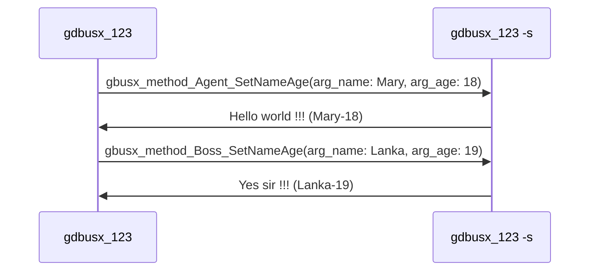
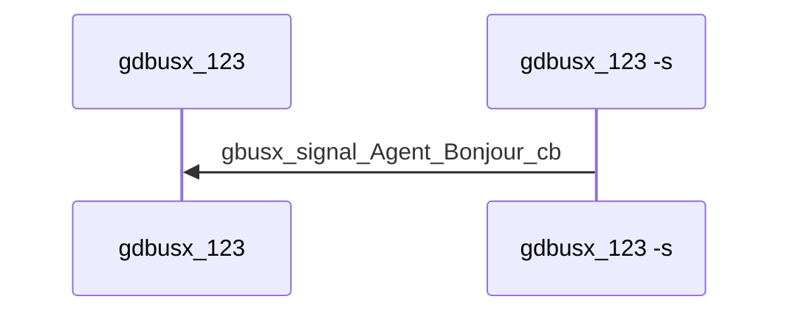

# 1. Overview
gdbusx provides simple GDBus APIs.

Please edit your  *.xml, run gdbus-codegen to generate C code. Then merge into your project and communicate between applications over GDBus.

# 2. Depend on

- [utilx9](https://github.com/lankahsu520/utilx9)

# 3. Current Status


# 4. Build
   ```
$ make
   ```

# 5. Example or Usage
- gdbusx_123 - gdbusx example.


# 6. License
gdbusx is under the New BSD License (BSD-3-Clause).


# 7. Documentation
Run an example and read it.

## 7.1. TestCase A

```c
<interface name="com.github.lankahsu520.agent">
  <method name="SetNameAge">
    <arg name="name" type="s" direction="in"/>
    <arg name="age" type="i" direction="in"/>
    <arg name="response" type="s" direction="out"/>
  </method>
</interface>

Client:
  GDBUSX_METHOD_SYNC(GDBUSX_IFAC_FUNC_AGENT, _set_name_age)((GDBUSX_OBJECT_AGENT*)gbusx_req->g_proxy, arg_name, arg_age, &out_response, NULL, &g_err);

Server:
  GDBUSX_METHOD_COMPLETE(GDBUSX_IFAC_FUNC_AGENT, _set_name_age)(object, invocation, retStr);

```

```c
<interface name="com.github.lankahsu520.boss">
  <method name="SetNameAge">
    <arg name="name" type="s" direction="in"/>
    <arg name="age" type="i" direction="in"/>
    <arg name="response" type="s" direction="out"/>
  </method>
</interface>

Client:
  GDBUSX_METHOD_SYNC(gbusx_IFAC_FUNC_BOSS, _set_name_age)((gbusx_OBJECT_BOSS*)gbusx_req->g_proxy, arg_name, arg_age, &out_response, NULL, &g_err);

Server:
  GDBUSX_METHOD_COMPLETE(gbusx_IFAC_FUNC_BOSS, _set_name_age)(object, invocation, retStr);

```

```c
<signal name="Bonjour">
  <arg name="greeting" type="s"/>
</signal>

Client:
  gbusx_signal_int(gbusx_req, "bonjour", gbusx_signal_Agent_Bonjour_cb);

Server:
  GDBUSX_SIGNAL_EMIT(GDBUSX_IFAC_FUNC_AGENT, _bonjour)((GDBUSX_OBJECT_AGENT*)gbusx_req->g_skeletion, greeting);

```

### 7.1.1. Method


### 7.1.2. Signal


