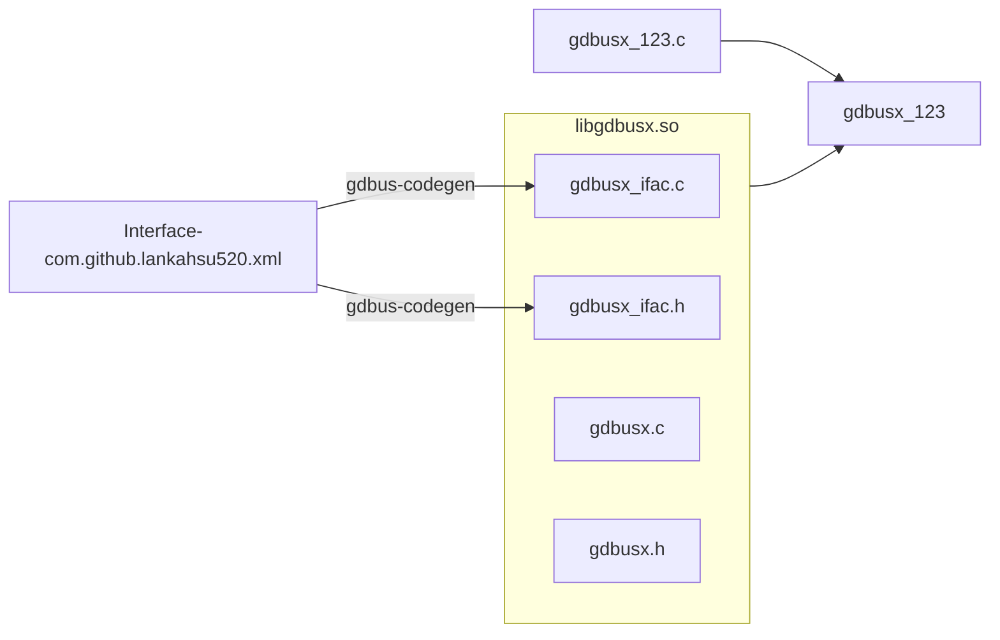
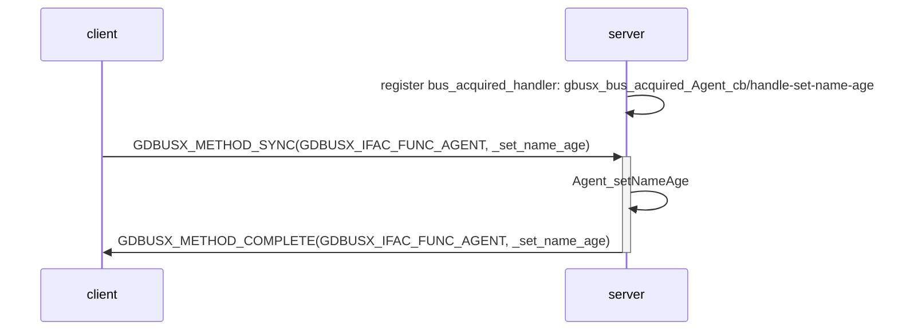
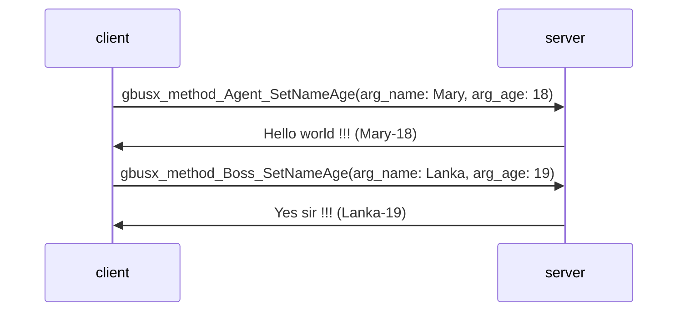
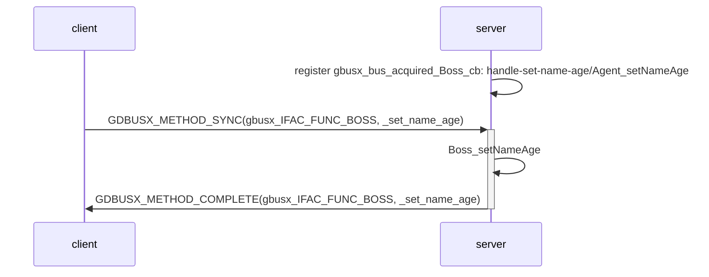
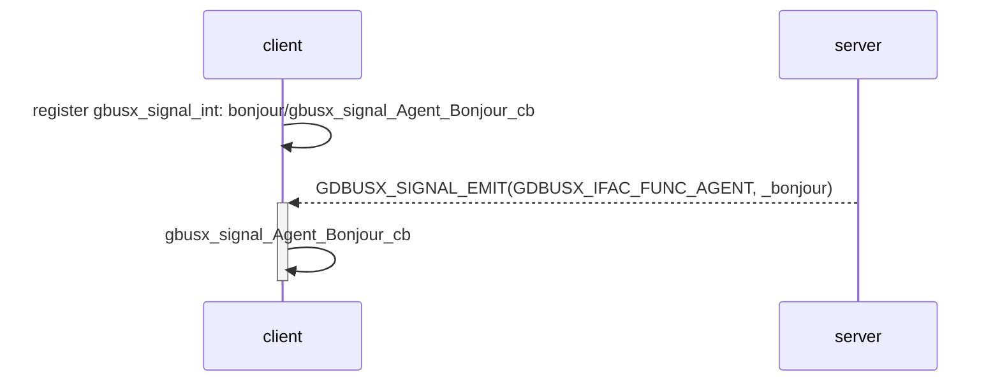
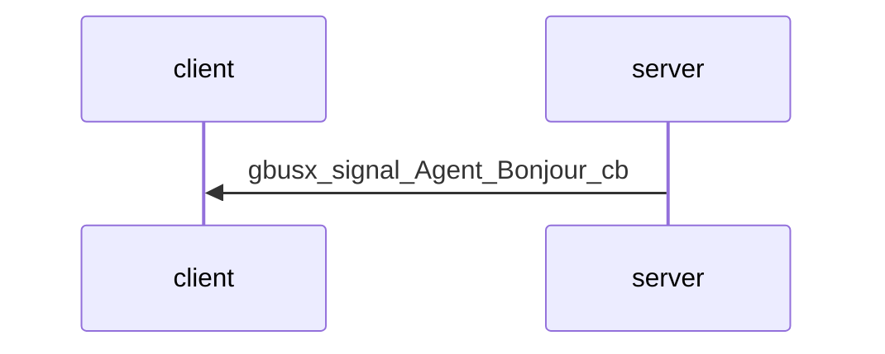

# 1. Overview

> gdbusx provides simple GDBus APIs.
>
> Please edit your  *.xml, run gdbus-codegen to generate C code. Then merge into your project and communicate between applications over GDBus.
>
> You just need to create client/server source codes and link with libgdbusx.so.



# 2. Depend on

#### - [utilx9](https://github.com/lankahsu520/utilx9)

# 3. Current Status


# 4. Build
   ```bash
$ cd /work/codebase/lankahsu520/utilx9
$ . confs/simple_x86.conf
$ make; make install
$ export LD_LIBRARY_PATH=`pwd`:$LD_LIBRARY_PATH

$ cd /work/codebase/lankahsu520/CvsCPPmixer
$ make
   ```

# 5. Example or Usage
#### - gdbusx_123 - gdbusx example.

#### - client - client example.

```bash
$ ./client
[10054/10055] gbusx_dummy_thread_handler:101 - Run loop ... (thread_name: thread_gbusx_agent, isservice: 0)
[10054/10056] gbusx_dummy_thread_handler:101 - Run loop ... (thread_name: thread_gbusx_boss, isservice: 0)
[10054/10055] gbusx_proxy_register_Agent_cb:158 - Linked !!! (com.github.lankahsu520.agent, is_quit: 0)
[10054/10055] gbusx_signal_int:22 - Linked !!! (com.github.lankahsu520.agent/bonjour)
[10054/10056] gbusx_proxy_register_Boss_cb:272 - Linked !!! (com.github.lankahsu520.boss, is_quit: 0)
[10054/10055] gbusx_signal_Agent_Bonjour_cb:134 - (arg_greeting: 1674223427 - 1)
[10054/10054] gbusx_method_Agent_SetNameAge:120 - (arg_name: Mary, arg_age: 18, out_response:Hello world !!! (Mary-18))
[10054/10054] gbusx_method_Boss_SetNameAge:241 - (arg_name: Lanka, arg_age: 19, out_response:Yes sir !!! (Lanka-19))
[10054/10054] gbusx_method_Agent_SetNameAge:120 - (arg_name: Mary, arg_age: 18, out_response:Hello world !!! (Mary-18))
[10054/10054] gbusx_method_Boss_SetNameAge:241 - (arg_name: Lanka, arg_age: 19, out_response:Yes sir !!! (Lanka-19))
[10054/10055] gbusx_signal_Agent_Bonjour_cb:134 - (arg_greeting: 1674223432 - 2)
[10054/10054] gbusx_method_Agent_SetNameAge:120 - (arg_name: Mary, arg_age: 18, out_response:Hello world !!! (Mary-18))
[10054/10054] gbusx_method_Boss_SetNameAge:241 - (arg_name: Lanka, arg_age: 19, out_response:Yes sir !!! (Lanka-19))
[10054/10055] gbusx_signal_Agent_Bonjour_cb:134 - (arg_greeting: 1674223437 - 3)
[10054/10054] gbusx_method_Agent_SetNameAge:120 - (arg_name: Mary, arg_age: 18, out_response:Hello world !!! (Mary-18))
[10054/10054] gbusx_method_Boss_SetNameAge:241 - (arg_name: Lanka, arg_age: 19, out_response:Yes sir !!! (Lanka-19))
^C[10054/10054] app_signal_handler:370 - (signum: 2)
[10054/10055] gbusx_dummy_thread_handler:127 - Bye-Bye !!! (thread_name: thread_gbusx_agent, isservice: 0)
[10054/10056] gbusx_dummy_thread_handler:127 - Bye-Bye !!! (thread_name: thread_gbusx_boss, isservice: 0)
[10054/10054] main:456 - Bye-Bye !!!
```

#### - server - server example.

```bash
$ ./server
[10047/10048] gbusx_dummy_thread_handler:101 - Run loop ... (thread_name: thread_gbusx_agent, isservice: 1)
[10047/10049] gbusx_dummy_thread_handler:101 - Run loop ... (thread_name: thread_gbusx_boss, isservice: 1)
[10047/10048] gbusx_bus_acquired_Agent_cb:136 - (gbusx_req->name: gbusx_agent, name: com.github.lankahsu520.agent)
[10047/10048] gbusx_bus_acquired_Boss_cb:230 - (gbusx_req->name: gbusx_boss, name: com.github.lankahsu520.boss)
[10047/10048] gbusx_name_acquired_cb:58 - (gbusx_req->name: gbusx_agent, name: com.github.lankahsu520.agent)
[10047/10048] gbusx_name_acquired_cb:58 - (gbusx_req->name: gbusx_boss, name: com.github.lankahsu520.boss)
[10047/10048] Agent_setNameAge:108 - (arg_name: Mary, arg_age: 18)
[10047/10048] Boss_setNameAge:204 - (arg_name: Lanka, arg_age: 19)
[10047/10048] Agent_setNameAge:108 - (arg_name: Mary, arg_age: 18)
[10047/10048] Boss_setNameAge:204 - (arg_name: Lanka, arg_age: 19)
[10047/10048] Agent_setNameAge:108 - (arg_name: Mary, arg_age: 18)
[10047/10048] Boss_setNameAge:204 - (arg_name: Lanka, arg_age: 19)
[10047/10048] Agent_setNameAge:108 - (arg_name: Mary, arg_age: 18)
[10047/10048] Boss_setNameAge:204 - (arg_name: Lanka, arg_age: 19)
^C[10047/10047] app_signal_handler:318 - (signum: 2)
[10047/10048] gbusx_dummy_thread_handler:127 - Bye-Bye !!! (thread_name: thread_gbusx_agent, isservice: 1)
[10047/10049] gbusx_dummy_thread_handler:127 - Bye-Bye !!! (thread_name: thread_gbusx_boss, isservice: 1)
[10047/10047] main:404 - Bye-Bye !!!
```

# 6. License

> gdbusx is under the New BSD License (BSD-3-Clause).


# 7. Documentation
## 7.1. [Method] agent - SetNameAge

```c
<interface name="com.github.lankahsu520.agent">
  <method name="SetNameAge">
    <arg name="name" type="s" direction="in"/>
    <arg name="age" type="i" direction="in"/>
    <arg name="response" type="s" direction="out"/>
  </method>
</interface>
```





## 7.2. [Method] boss - SetNameAge

```c
<interface name="com.github.lankahsu520.boss">
  <method name="SetNameAge">
    <arg name="name" type="s" direction="in"/>
    <arg name="age" type="i" direction="in"/>
    <arg name="response" type="s" direction="out"/>
  </method>
</interface>
```



## 7.3. [Signal] agent - Bonjour

```c
<interface name="com.github.lankahsu520.agent">
  <signal name="Bonjour">
  	<arg name="greeting" type="s"/>
  </signal>
</interface>
```


